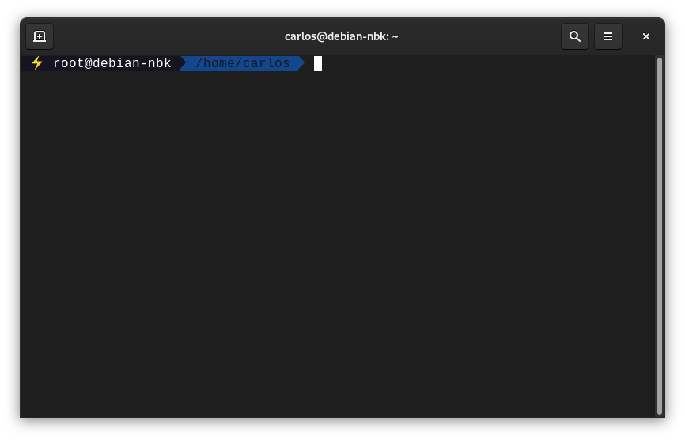
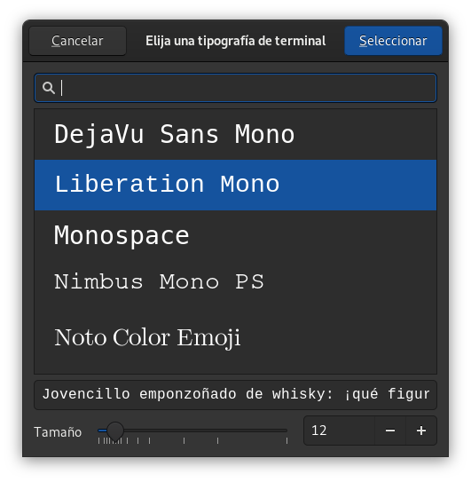

Title: ¿Cómo personalizar la terminal con oh my bash?
Date: 2022-11-06 15:53
Tags: linux bash terminal 
Category: Linux
Authors: Carlos Carrasco Varas
Summary: En este tutorial aprenderemos a como personalizar la terminal y obtener beneficios visuales, como por ejemplo ver en que rama se esta trabajando.

# **¿Cómo personalizar la terminal con oh my bash?**

## **Pasos previos**

Lo primero que debemos hacer es comprobar si es que tenemos instalado [git](https://git-scm.com/) y si tenemos instalado [curl](https://curl.se/). Esto lo comprobaremos en nuestra terminal de la siguiente manera:

~~~text
$ git --version
git version 2.30.2
~~~

~~~text
$ curl --version
curl 7.74.0 (x86_64-pc-linux-gnu) libcurl/7.74.0 OpenSSL/1.1.1n zlib/1.2.11 brotli/1.0.9 libidn2/2.3.0 libpsl/0.21.0 (+libidn2/2.3.0) libssh2/1.9.0 nghttp2/1.43.0 librtmp/2.3
Release-Date: 2020-12-09
Protocols: dict file ftp ftps gopher http https imap imaps ldap ldaps mqtt pop3 pop3s rtmp rtsp scp sftp smb smbs smtp smtps telnet tftp 
Features: alt-svc AsynchDNS brotli GSS-API HTTP2 HTTPS-proxy IDN IPv6 Kerberos Largefile libz NTLM NTLM_WB PSL SPNEGO SSL TLS-SRP UnixSockets
~~~

Si no tuviésemos instalado alguno de ellos debemos instalarlos con el siguiente comando:

Para instalar git:
~~~
$ apt-get install git
~~~

Para instalar curl:
~~~
$ apt-get install curl
~~~

## **Identificando nustro archivo .bashrc**
Este archivo es el que contiene las configuraciones de nuestra terminal. Es por esa razón que es fundamental encontrarlo ya que próximamente haremos modificaciones sobre éste.
En general el archivo *.bashrc* lo encontraremos en `\home\usuario` si hacemos un `$ ls -al` nos debería aparecer este archivo *.bashrc*

## **Instalando oh my bash**

Para instalar [oh my bash](https://github.com/ohmybash/oh-my-bash) debemos dirigirnos al siguiente enlace https://github.com/ohmybash/oh-my-bash en donde se encontraran dos formas de instalarlo. Para el caso de este tutorial optaremos por la vía de curl ejecutando la siguiente línea en la terminal:

~~~text
bash -c "$(curl -fsSL https://raw.githubusercontent.com/ohmybash/oh-my-bash/master/tools/install.sh)"
~~~

 Una vez instalado ya deberían producirse cambios en nuestra terminal.
 
## **Instalando tema agnoster**
 Uno de mis temas favoritos es el de [agnoster](https://github.com/ohmybash/oh-my-bash/tree/master/themes/agnoster) el cual tiene una configuración adicional para que funcione. Para ello nos vamos al repositorio y encontraremos las siguientes instrucciones:

~~~text
$ git clone https://github.com/powerline/fonts.git fonts
$ cd fonts
$ ./install.sh
~~~

## **Configurando .bashrc**

Una vez instalado [oh my bash](https://github.com/ohmybash/oh-my-bash) y  [agnoster](https://github.com/ohmybash/oh-my-bash/tree/master/themes/agnoster) para que surjan los cambios debemos modificar nuestro archivo *.bashrc* y editar la línea y dejarla de la siguiente forma `OSH_THME = "agnoster"`. Se guardan los cambios y en la terminal escribimos lo siguiente:

~~~text
source .bashrc
~~~

y se debería ver de la siguiente manera:

> ***nota***: Si por alguna razón no se ve de igual manera es probable que debas ajustar la fuente de tu terminal. En mi caso para que se pueda ver así utilicé *Liberation mono* como se ve en la imagen. 

## **Fuentes**
Toda la información que puedes ver acá esta contenida en el siguiente video:

<iframe width="560" height="315" src="https://www.youtube.com/embed/qi5Vzw5AU9M" title="YouTube video player" frameborder="0" allow="accelerometer; autoplay; clipboard-write; encrypted-media; gyroscope; picture-in-picture" allowfullscreen></iframe>

## **Experiencia del autor**
A mi parecer instalar [oh my bash](https://github.com/ohmybash/oh-my-bash) ha aumentado mi productividad ya que puedo obtener bastante información desde la terminal. Puedo ver con claridad en qué rama estoy trabajando si es que estoy en un entorno virtual además de la ruta. Por lo demás, se ve genial! Espero que te haya sido útil este tutorial y no te olvides de enviarme un [tuit](https://twitter.com/Krlitos_Forever) diciendo *Hey Carlos! estoy en tu github pages!* Eso me haría muy feliz.
